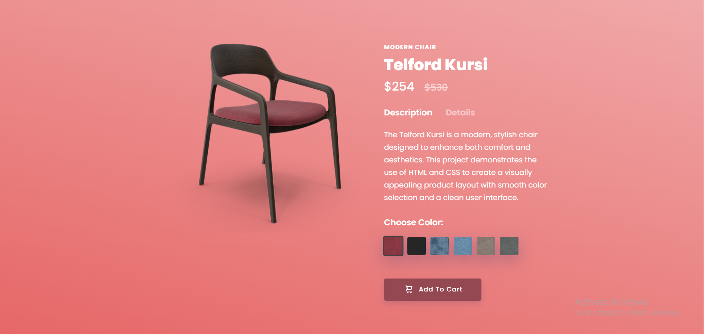

# 🪑 Modern Chair – Product Showcase UI

Modern Chair is a **minimal and elegant product showcase web UI** designed to display a modern chair with details such as pricing, dimensions, color variants, and an interactive add-to-cart button.  
The project focuses on **clean design, smooth UI, and modern frontend practices**.

---

## 🔗 Live Demo

👉 **Live Website**  
[WEB LINK](https://abhidwi1.github.io/Modern_Chair/)

---

## ✨ Features

- Modern and minimal product UI  
- Product details section (price, size, weight)  
- Color selection options  
- Clean typography and layout  
- Responsive design  
- Smooth user experience  

---

## 🛠️ Tech Stack

- **HTML5**  
- **CSS3**   
- **Modern UI Design Principles**


---
## 📸 Preview



---

## 📂 Project Structure

```bash
Modern_Chair/
├── index.html
├── style.css
├── script.js
├── assets/
├── screenshots/
└── README.md

